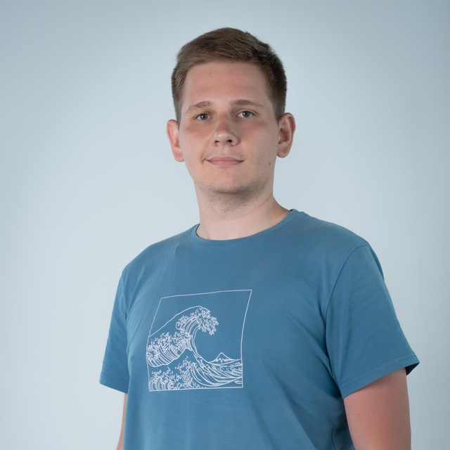

### Hi, I'm Leonid 👋

**Backend Engineer** from Tashkent, Uzbekistan 🇺🇿
Building reliable backends in **fintech** and **medtech** — now going deep into **blockchain** and **Web3 security**.

I care about *engineering beauty*: clean architecture, systems designed to scale, and code I'd still be proud to read a year from now. I'd rather build it right than build it twice.

---

### 🛠️ Tech I work with

---

### 🔭 What I'm doing now

- Learning **Solidity & Rust** for Web3 — smart contracts, the EVM, and Rust-based chains & tooling
- Going deep into **Web3 security**: actively hunting in **bug bounty programs**, working toward becoming a strong **smart-contract / Web3 audit specialist**
- Studying **distributed systems & system design** (going to the specs and source, not just the docs)
- Wrapping up my **B.Sc. in Software Engineering** @ ITPU (Inha University in Tashkent)

> 🎯 **Goal:** combine my backend depth with Rust + Web3 to audit and secure smart contracts.

### 🚀 Things I've built

- **Split The Bill** — a Telegram Web App that splits a restaurant bill by who-ate-what (Laravel + TypeScript). *My diploma project.*
- **Backend services in production** — core & card services for a fintech BNPL product (PHP/Laravel), and patient/clinic services in medtech.
- **Defense** — a medieval tower-defense game in **Godot**, because gamedev is my playground.
- Smaller experiments: a Telegram bot platform, a self-hosting / billing service on NestJS + Proxmox, a movie recommendation API.

### 💡 How I like to work

- Clean, deliberate **architecture** over quick hacks
- Room to **research, prototype and do things properly** — quality is a feature
- Backend / infrastructure / systems problems over UI tweaking
- Building tools that **genuinely help people**, alongside good engineers

### 🌱 Beyond the keyboard

Running and mountain hikes 🏃‍♂️⛰️, 3D modeling in Blender, drums 🥁, and a soft spot for Japanese art and anime — yes, that's Hokusai's *Great Wave off Kanagawa* on my shirt 🌊.

---

### 📊 GitHub

### 📫 Let's connect

“I'd rather build it right than build it twice.”
